  

 

 

  

 

## 🧰 &nbsp;Stack

  

 

  

 

## 🎯 &nbsp;Focus

Senior Infrastructure/SRE engineer designing and operating platform-level systems — multi-cluster Kubernetes, org-wide CI/CD, cost governance, and compliance-grade security — for engineering orgs, not single apps.

 

Currently building out a self-service internal platform on top of a multi-cluster Kubernetes fleet, and driving cost + compliance governance across a multi-account AWS Organization.

 

## 🏛️ &nbsp;Platform & architecture initiatives

Systems built for organizational scale — multiple teams, multiple environments, real business constraints. Each one written as Problem → Architecture → Business impact.

 

<table>
<tr>
<td width="50%" valign="top">

#### 🌐 &nbsp;Multi-Cluster Kubernetes Platform
Fleet management across prod, staging & DR

*Problem* — 15+ microservices deployed inconsistently across environments, no shared golden path, each team reinventing manifests 
*Architecture* — 3-cluster fleet (prod / staging / DR across regions) managed via ArgoCD ApplicationSets, shared Helm library charts, centralized RBAC + OPA/Gatekeeper policy enforcement, Cilium for cross-cluster networking 
*Business impact* — cut new-service provisioning from days to under an hour; policy-as-code eliminated an entire class of misconfiguration incidents across teams

`ArgoCD` `OPA/Gatekeeper` `Cilium` `Helm`

</td>
<td width="50%" valign="top">

#### 💵 &nbsp;Org-Wide Cost Governance (FinOps)
Multi-account AWS Organization, $50K+/mo spend

*Problem* — no cost visibility across 10+ AWS accounts, no accountability per team, spend growing faster than usage 
*Architecture* — AWS Organizations + Control Tower guardrails, Cost & Usage Reports into Athena/QuickSight, per-team showback dashboards, automated Savings Plan/RI purchase recommendations, budget alerts tied to Slack 
*Business impact* — ~22% reduction in monthly cloud spend org-wide, full cost attribution per team enabling accurate project P&L

`AWS Organizations` `Athena` `Control Tower`

</td>
</tr>
<tr>
<td width="50%" valign="top">

#### 🔁 &nbsp;Monolith → Microservices Migration
Zero-downtime cutover of a live production system

*Problem* — legacy monolith blocking independent team releases, single point of failure for the whole platform 
*Architecture* — strangler-fig pattern: new services stood up behind an API gateway, traffic shifted incrementally via weighted routing, dual-write + backfill for data consistency, rollback plan rehearsed before each cutover phase 
*Business impact* — migrated a live revenue-generating system with zero customer-facing downtime; independent team deploys went from weekly-coordinated releases to on-demand

`API Gateway` `Strangler Fig` `Dual-Write`

</td>
<td width="50%" valign="top">

#### 🛡️ &nbsp;Compliance-Grade Infrastructure
Audit-ready hardening (SOC 2 / PCI-DSS style controls)

*Problem* — infra couldn't pass a compliance audit: no encryption enforcement, no access reviews, no tamper-evident logs 
*Architecture* — encryption-at-rest/in-transit enforced via SCPs, quarterly IAM access reviews automated with a Lambda, immutable CloudTrail → S3 Object Lock audit trail, compliance-as-code checks (Conftest/OPA) gating every CI pipeline 
*Business impact* — passed external audit readiness review with zero critical findings; compliance checks now block non-compliant infra before it ships

`SCP` `CloudTrail` `Conftest`

</td>
</tr>
<tr>
<td width="50%" valign="top">

#### 🚨 &nbsp;Incident Command & SLO Program
Formal on-call, postmortems & error-budget enforcement

*Problem* — incidents handled ad hoc, no on-call rotation, repeat outages from the same unaddressed root causes 
*Architecture* — SLO/error-budget framework per service, PagerDuty-based on-call rotation with clear escalation paths, blameless postmortem process with tracked action items, runbook library tied to alerts 
*Business impact* — reduced MTTR org-wide, repeat-incident rate dropped as postmortem action items were enforced through the sprint process

`SLO/Error Budgets` `PagerDuty` `Postmortems`

</td>
<td width="50%" valign="top">

#### 🧭 &nbsp;Internal Developer Platform (Self-Service)
Golden paths for 20+ engineers across product teams

*Problem* — platform team was a bottleneck for every new service, environment, or pipeline request 
*Architecture* — Backstage developer portal + ArgoCD GitOps backend, scaffolded golden-path templates (service + CI + monitoring + alerting in one PR), self-service environment provisioning with guardrails baked in 
*Business impact* — platform-team ticket load dropped sharply as teams self-served; new-service lead time went from multi-day platform-team dependency to same-day, engineer-driven

`Backstage` `ArgoCD` `Golden Paths`

</td>
</tr>
</table>

 

## ⚙️ &nbsp;Infrastructure in production

Systems I've designed, deployed, and currently operate — written as case studies because the decisions matter more than the tech list.

 

<table>
<tr>
<td width="50%" valign="top">

#### 🧩 &nbsp;BookVault
Self-managed K3s cluster, service mesh & GitOps

A 3-node K3s cluster running Django/MySQL, built as hands-on infra for CKA-level operations — not a managed EKS shortcut.

*Problem* — needed real exposure to scheduling, networking, and RBAC that managed Kubernetes abstracts away 
*Approach* — self-managed control plane, Linkerd mesh tracking golden-signal metrics, Jenkins + ArgoCD GitOps delivery, Traefik + cert-manager TLS 
*Hardening* — RBAC, NetworkPolicy, HPA/VPA, node affinity, init containers, Redis caching 
*Observability* — Prometheus + Grafana + AlertManager → Telegram

`K3s` `Linkerd` `ArgoCD` `Jenkins` `Prometheus`

</td>
<td width="50%" valign="top">

#### ⚙️ &nbsp;Electronix
Distributed Jenkins CI/CD, production MERN app

Full-stack e-commerce platform where the interesting work is the delivery pipeline.

*Problem* — needed zero hardcoded credentials and a clean deploy path to S3/CloudFront 
*Approach* — dedicated SSH-based Jenkins agent, declarative pipeline (build → S3 → CloudFront invalidation), IAM role-based auth, CloudFront OAC over private S3 
*Migration* — moved backend from MongoDB to MySQL/Sequelize across 5 relational models with junction tables — a schema redesign, not a lift-and-shift

`Jenkins` `S3/CloudFront` `MySQL` `Razorpay`

</td>
</tr>
<tr>
<td width="50%" valign="top">

#### 🔐 &nbsp;SimpleBank
Zero-SSH, keyless AWS-native CI/CD

Design goal: eliminate standing access, not just automate deploys.

*Problem* — long-lived SSH keys and static credentials are a standing attack surface 
*Approach* — GitHub Actions via OIDC (no stored credentials), deploys through SSM Session Manager (no open SSH port), secrets from SSM Parameter Store, images through ECR

`Flask` `OIDC` `SSM` `ECR`

</td>
<td width="50%" valign="top">

#### 🎯 &nbsp;IQuiz Hub
Production platform on ECS Fargate

React/Node/MongoDB quiz platform with a proctored coding-exam module.

*Problem* — ECS deployments were failing silently under the circuit breaker 
*Approach* — diagnosed and resolved circuit-breaker rollback failures and an nginx port-mapping misconfig in production — failures that only surface under real deploy conditions 
*Features* — Monaco-based anti-cheat exam module, cascade-delete data integrity

`ECS Fargate` `React` `MongoDB`

</td>
</tr>
</table>

📂 &nbsp;More projects — serverless blog, security tooling, IaC deployment

 

🌐 &nbsp;**DevOps World** — fully serverless blog (`blog.devilhai.info`): S3 + CloudFront (OAC) + Route 53 + ACM for the frontend, Cognito for auth, SES for email, Lambda behind API Gateway for subscriber onboarding, DynamoDB for post metadata.

🚨 &nbsp;**SSH Intrusion Monitor** — `systemd`-managed service tailing `/var/log/auth.log` in real time, geolocating suspicious source IPs and firing SMTP alerts, paired with a cron-driven bash-history audit digest.

☁️ &nbsp;**TaskMaster** — Flask/MongoDB Atlas app with infrastructure fully defined in Terraform, shipped as a versioned Docker image.

📖 &nbsp;**Kubernetes Internals Guide** — a 20-section, self-authored technical reference written while building the K3s cluster above, now used as training material.

 

## 📈 &nbsp;GitHub activity

 

 

 

💬 &nbsp;Open to conversations on SRE practice, cloud architecture, or mentoring engineers.
 
<a href="https://www.linkedin.com/in/YOUR-LINKEDIN-HANDLE">LinkedIn</a> · <a href="https://blog.devilhai.info">Blog</a>

